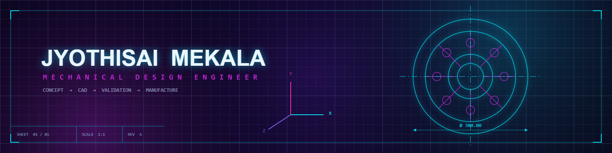
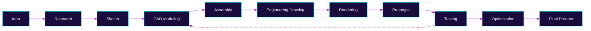

<!-- ════════════════════════════════════════════════════════════════
     BANNER — replace assets/banner.png with your CAD-style artwork
     Concept: matte-black blueprint ground · technical grid · dimension
     lines · centerlines · XYZ coordinate axes · wireframe motorcycle ·
     exploded mechanical assembly · construction geometry · neon cyan
     Recommended export: 1600 × 400 px, PNG
     ════════════════════════════════════════════════════════════════ -->

<!-- Optional: replace the gradient header above with your own CAD banner
      -->

 

 

 

 

I design products that can actually be built.

My work sits between the sketch and the shop floor: taking an idea through research, geometry, tolerance and material choice until it becomes a manufacturable, documented, production-ready assembly.

**Focus areas**

 🎧&nbsp; Ergonomics · enclosures · assembly-friendly geometry

 🚗&nbsp; Brackets · housings · functional mechanical parts

 🏍️&nbsp; Aftermarket and performance component design

 ⚙️&nbsp; Frames · fixtures · machine sub-assemblies

 🎬&nbsp; Rendering · exploded views · presentation drawings

 🧊&nbsp; Print-oriented design · tolerancing · fast iteration
n |

Previously I worked in system-focused engineering environments where precision, ownership, structured workflows, disciplined execution and consistently hitting targets were non-negotiable. That mindset — document everything, verify before you ship, respect the tolerance — is exactly what I now bring to mechanical product design.

This GitHub is the working record of that journey: every concept, sketch iteration, CAD model, drawing set and revision, kept in the open from first idea to production-ready file.

 

 

`OBSERVE` · `DEFINE` · `SKETCH` · `MODEL` · `VALIDATE` · `REFINE` · `MANUFACTURE`

 

> **Design is not finished when nothing can be added.**
> **It is finished when nothing can fail.**

 

 

**Software**

**Engineering Capability**

 

 

📐&nbsp; &nbsp; 

🧩&nbsp; &nbsp; 

🔩&nbsp; &nbsp; 

📄&nbsp; &nbsp; 

📏&nbsp; &nbsp; 

🏭&nbsp; &nbsp; 

🎬&nbsp; &nbsp; 

🔍&nbsp; &nbsp; 

🌀&nbsp; &nbsp; 

🗂️&nbsp; &nbsp; 

 

 

Testing feeds back into the model — iteration is part of the process, not a failure of it.

 

 

<b>🎧&nbsp; Consumer Product Design</b>&nbsp;&nbsp;

 

Ergonomic housing study for a handheld consumer device, designed around injection-moulding constraints and snap-fit assembly.

- Draft analysis
- Wall-thickness study
- Snap-fit detailing

🔗 Repository — coming soon

<b>🏍️&nbsp; Motorcycle Component Design</b>&nbsp;&nbsp;

 

Aftermarket bracket and mounting hardware set, modelled to fit existing frame geometry with clearance verification.

- Reverse-engineered mounting points
- Clearance + interference checks
- Load-path reasoning

🔗 Repository — coming soon

<b>⚙️&nbsp; Industrial Equipment</b>&nbsp;&nbsp;

 

Machine sub-assembly and weldment frame with load-path reasoning and a full manufacturing drawing set.

- Frame + fixture design
- Manufacturing drawing set
- Standard-parts library

🔗 Repository — coming soon

<b>🧊&nbsp; 3D Printable Products</b>&nbsp;&nbsp;

 

A library of print-ready parts designed for tolerance, orientation and minimal support material.

- Print-orientation strategy
- Tolerance test coupons
- Support-free geometry

🔗 Repository — coming soon

<b>🔩&nbsp; Mechanical Assemblies</b>&nbsp;&nbsp;

 

Multi-part assemblies with mates, motion study and interference detection, documented as exploded views.

- Mate schemes
- Interference detection
- Exploded-view documentation

🔗 Repository — coming soon

<b>📄&nbsp; Engineering Drawings</b>&nbsp;&nbsp;

 

A growing set of production drawings: sections, details, tolerancing and GD&T applied to real parts.

- Section + detail views
- GD&T application
- Title-block standards

🔗 Repository — coming soon

 

 

### "A drawing is a promise. Every dimension on it is a commitment to reality."

 

 

Open to collaborating on innovative mechanical product design, CAD modelling and engineering documentation work — from a single component to a full assembly.

 

 

Designed, modelled and documented by **Jyothisai Mekala** · Mechanical Design Engineer

`CONCEPT` — `CAD` — `VALIDATION` — `PRODUCTION`

