 

## 01 // About

Mechanical engineer (**B.Tech, 86%**) whose design foundation comes from **projects rather than coursework**: a modal analysis study of a vehicle roll cage frame, a magnet-driven engine fabricated and tested from scratch, and parts modelled in **SolidWorks, AutoCAD and CATIA**.

After four years in IT at Tata Consultancy Services, I'm returning to mechanical design full time.

<table>
<tr>
<td width="50%" valign="top">

**⚙️ Right now**

- 🖨️ Designing and 3D printing prototypes to written briefs on my own FDM printer
- 📐 Completing a **GD&T** course at PUMO Technovation, Chennai
- 🧩 Learning **sheet metal design**
- 🗂️ Keeping my CAD and drawing files public and versioned

</td>
<td width="50%" valign="top">

**🎯 Looking for**

- Full-time, **onsite**, entry-level mechanical design role
- Hands-on with CAD, drawings, tolerancing and prototyping
- Based in Chennai, India
- **Available immediately**

</td>
</tr>
</table>

## 02 // Numbers from my projects

## 03 // Toolbox

## 04 // How I build a prototype

I take a written brief from engineering students, interpret the functional requirement, and hand back a printed prototype they can assemble and test. I design for the process rather than around it: wall thickness, overhang and support strategy, print orientation for load direction, and clearance on mating features. Every failed print is data: I work out whether the fault sits in the model, the orientation or the machine, and fix the cause rather than the symptom.

## 05 // Projects

### 🖨️ Prototype Design & 3D Printing &nbsp;`ongoing`
Self-directed practice on my own FDM printer. I own the whole loop alone: concept sketch → CAD model → printability review → slicing → print → measure against the model → correct → reprint.

### 🗂️ Public CAD & Drawing Repository &nbsp;`ongoing`
[github.com/jyothisaimekala](https://github.com/jyothisaimekala): CAD and drawing files organised per project, so a reviewer can trace a design from the first model through revisions to the printed part.

Recent practice pieces:
- L-bracket with gusset / stiffener ribs
- Swan-neck cam lever profile
- Bolt-circle gasket plate (polar array, PCD construction geometry)
- ISO A4 landscape drawing-sheet template: frame, zone grid, title block, first-angle projection symbol

### 🛡️ Modal Analysis of Roll Cage Frame for Optimum Design &nbsp;`B.Tech major project · 2021`
*Team of 4 · Chadalawada Ramanamma Engineering College (JNTU Anantapur)*
- Modelled the frame in **CATIA V5** and ran modal analysis in **ANSYS 15.0** to extract natural frequencies and mode-shape deformations, assessing occupant safety under rollover loading.
- Built and analysed **6 frame variants** (top-member length ratio), then extended the study to **3 reinforcement variants** (side, back and top cross-members).
- Best configuration, **side-and-back cross-members**: up to **33.9% higher first-mode natural frequency** and **17.9% lower peak deformation** than the weakest variant.
- Split analysis and reporting across the team and presented the trade-offs to faculty reviewers.

### 🧲 Design & Fabrication of an Electromagnetic Engine &nbsp;`Diploma final-year project · 2018`
*Team of 4 · Sri Kalahasteeswara Institute of Technology*
- Designed a zero-fuel engine that replaces spark plugs and valves with an **electromagnet and NdFeB permanent-magnet piston**, using attraction and repulsion instead of combustion to drive reciprocating motion.
- Chose non-magnetic materials (aluminium cylinder, non-magnetic stainless-steel / titanium piston casing) to contain the field and cut weight versus a cast-iron IC engine.
- Built the coil, relay-and-timer control circuit and battery supply; fabricated and tested a working prototype (fuel-free, zero-emission, low-noise) and outlined an ECU-based path to more power.

## 06 // Background

| | |
|---|---|
| **Experience** | **System Engineer, Tata Consultancy Services** · Mar 2022 – May 2026 · Chennai Supported production infrastructure under strict change control, traced incidents to root cause with documented fixes, automated repetitive tasks, and wrote the runbooks and configuration documents the team worked from: the same discipline a drawing office applies to controlled documents. |
| **Education** | **B.Tech, Mechanical Engineering** · Chadalawada Ramanamma Engineering College (JNTU Anantapur) · 2018–2021 · 86% **Diploma, Mechanical Engineering** · Sri Kalahasteeswara Institute of Technology · 2015–2018 · 78% |
| **Training** | AutoCAD & SolidWorks (completed) · GD&T, PUMO Technovation, Chennai (in progress) |
| **Languages** | English (fluent) · Telugu (fluent) · Hindi (intermediate) · Tamil (beginner) |

 

