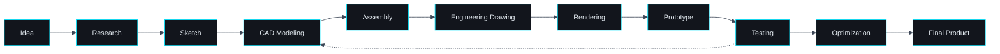

<!-- ════════════════════════════════════════════════════════════════
     BANNER — replace assets/banner.png with your CAD-style artwork
     Concept: matte-black blueprint ground · technical grid · dimension
     lines · centerlines · XYZ coordinate axes · wireframe motorcycle ·
     exploded mechanical assembly · construction geometry · neon cyan
     Recommended export: 1600 × 400 px, PNG
     ════════════════════════════════════════════════════════════════ -->

<!-- Optional: replace the gradient header above with your own CAD banner
      -->

 

 

 

 

## About

I design products that can actually be built.

My work sits between the sketch and the shop floor: taking an idea through research, geometry, tolerance and material choice until it becomes a manufacturable, documented, production-ready assembly.

**Focus areas**

| | |
| :-- | :-- |
| **Consumer Products** | Ergonomics, enclosures, assembly-friendly geometry |
| **Automotive Components** | Brackets, housings, functional mechanical parts |
| **Motorcycle Parts** | Aftermarket and performance component design |
| **Industrial Equipment** | Frames, fixtures, machine sub-assemblies |
| **Product Visualization** | Rendering, exploded views, presentation drawings |
| **3D Printable Products** | Print-oriented design, tolerancing, iteration |

Previously I worked in system-focused engineering environments where precision, ownership, structured workflows, disciplined execution and consistently hitting targets were non-negotiable. That mindset — document everything, verify before you ship, respect the tolerance — is exactly what I now bring to mechanical product design.

This GitHub is the working record of that journey: every concept, sketch iteration, CAD model, drawing set and revision, kept in the open from first idea to production-ready file.

 

 

## Engineering Philosophy

`OBSERVE` · `DEFINE` · `SKETCH` · `MODEL` · `VALIDATE` · `REFINE` · `MANUFACTURE`

 

> **Design is not finished when nothing can be added.**
> **It is finished when nothing can fail.**

 

 

## CAD Toolbox

**Software**

**Engineering Capability**

 

 

## Currently Building Depth In

| Discipline | Progress |
| :-- | :-- |
| AutoCAD Professional Workflow | `████████████████░░░░` |
| SOLIDWORKS Advanced Modeling | `██████████████░░░░░░` |
| Assembly Design | `█████████████░░░░░░░` |
| Engineering Drawings | `███████████████░░░░░` |
| GD&amp;T | `█████████░░░░░░░░░░░` |
| Design for Manufacturing | `███████████░░░░░░░░░` |
| Product Visualization | `████████████░░░░░░░░` |
| Reverse Engineering | `████████░░░░░░░░░░░░` |
| Motion Study | `███████░░░░░░░░░░░░░` |
| Design Documentation | `██████████████░░░░░░` |

 

 

## Engineering Workflow

Testing feeds back into the model — iteration is part of the process, not a failure of it.

 

 

## Featured Projects

<table>
<tr>
<td width="50%" valign="top">

### Consumer Product Design

`STATUS — IN PROGRESS`

Ergonomic housing study for a handheld consumer device, designed around injection-moulding constraints and snap-fit assembly.

**Tools** · SOLIDWORKS · Blender
**Repository** · _link coming soon_

</td>
<td width="50%" valign="top">

### Motorcycle Component Design

`STATUS — IN PROGRESS`

Aftermarket bracket and mounting hardware set, modelled to fit existing frame geometry with clearance verification.

**Tools** · SOLIDWORKS · AutoCAD
**Repository** · _link coming soon_

</td>
</tr>
<tr>
<td width="50%" valign="top">

### Industrial Equipment

`STATUS — PLANNED`

Machine sub-assembly and weldment frame with load-path reasoning and a full manufacturing drawing set.

**Tools** · SOLIDWORKS · Engineering Drawings
**Repository** · _link coming soon_

</td>
<td width="50%" valign="top">

### 3D Printable Products

`STATUS — IN PROGRESS`

A small library of print-ready parts designed for tolerance, orientation and minimal support material.

**Tools** · SOLIDWORKS · Blender · FDM
**Repository** · _link coming soon_

</td>
</tr>
<tr>
<td width="50%" valign="top">

### Mechanical Assemblies

`STATUS — PLANNED`

Multi-part assemblies with mates, motion study and interference detection, documented as exploded views.

**Tools** · SOLIDWORKS · Motion Study
**Repository** · _link coming soon_

</td>
<td width="50%" valign="top">

### Engineering Drawings

`STATUS — ONGOING`

A growing set of production drawings: sections, details, tolerancing and GD&amp;T applied to real parts.

**Tools** · AutoCAD · SOLIDWORKS Drawings
**Repository** · _link coming soon_

</td>
</tr>
</table>

 

 

## Activity

  

  

 

 

### "A drawing is a promise. Every dimension on it is a commitment to reality."

 

 

## Contact

Open to collaborating on innovative mechanical product design, CAD modelling and engineering documentation work — from a single component to a full assembly.

 

 

Designed, modelled and documented by **YOUR NAME** · Mechanical Design Engineer

`CONCEPT` — `CAD` — `VALIDATION` — `PRODUCTION`

